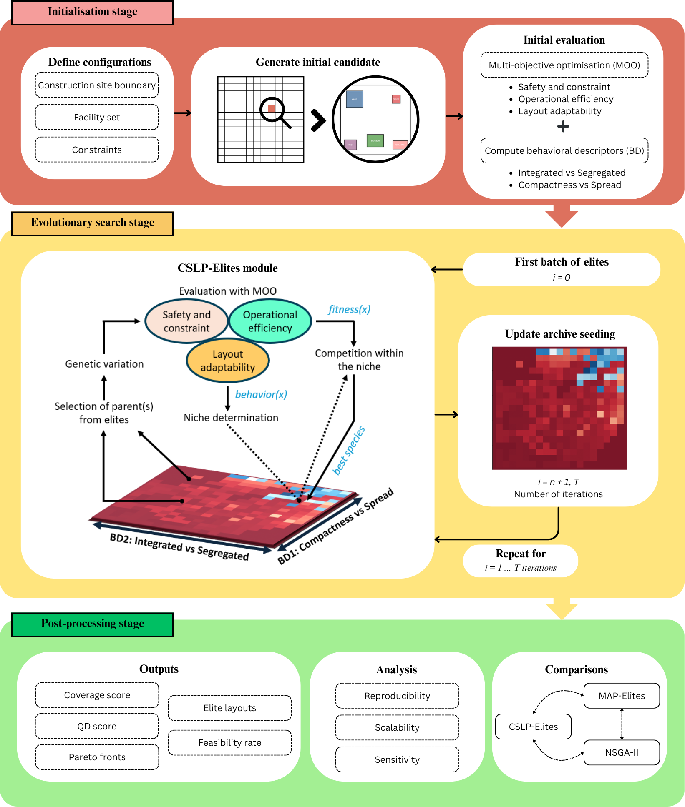
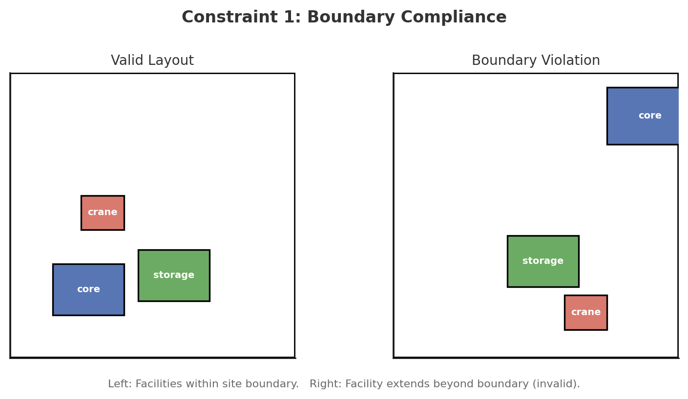
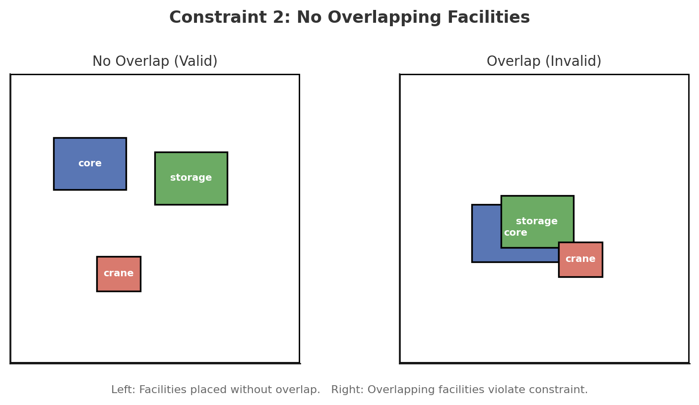
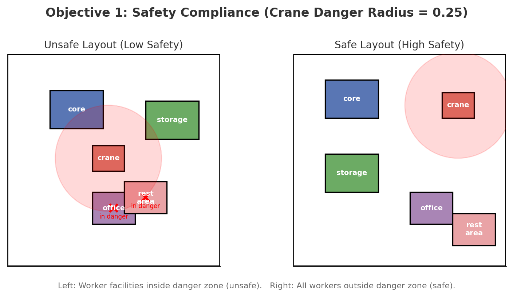
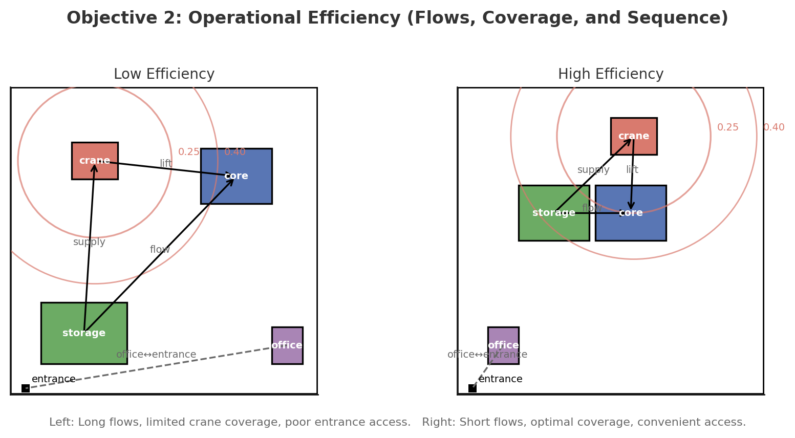
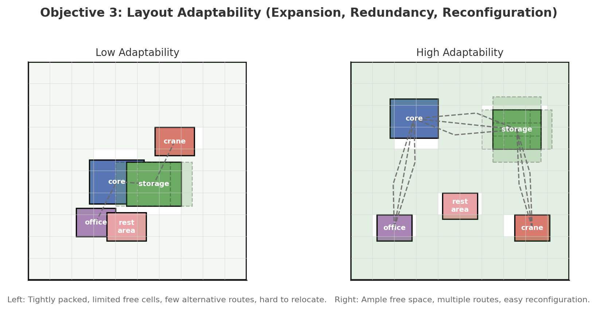
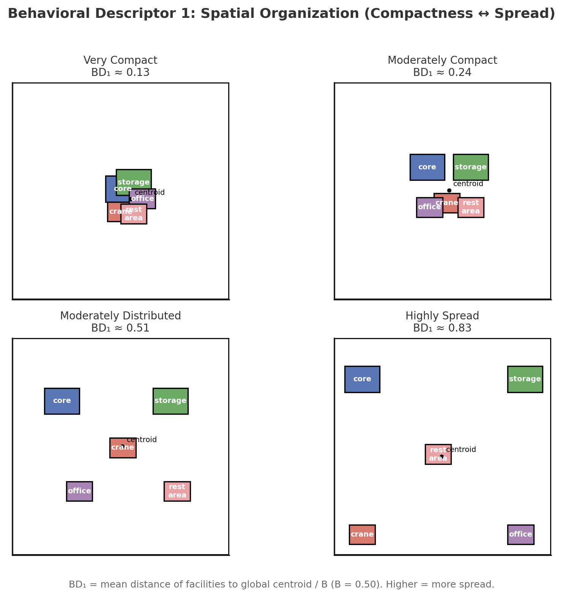
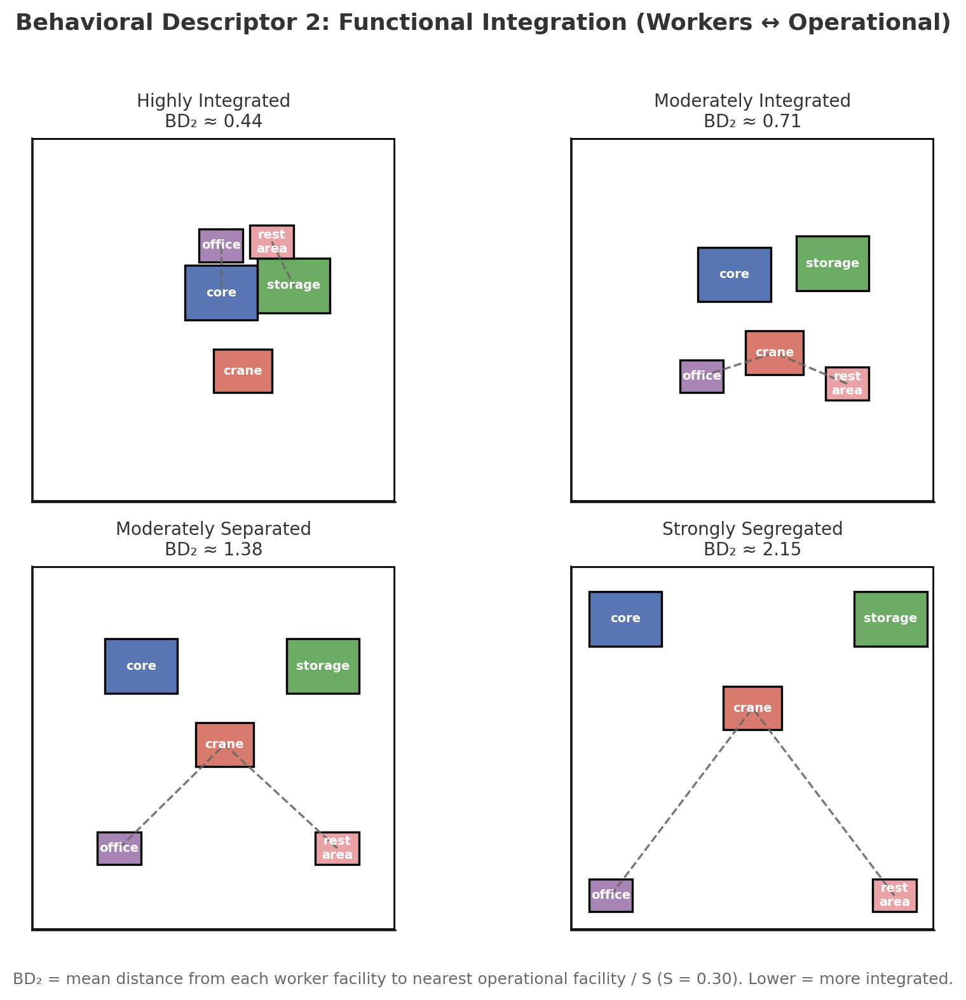

# Project Information

In CEXO, our goal is to **generate diverse and high-performing construction site layouts** that balance safety, efficiency, and adaptability. To achieve this, the framework combines objective functions, behavioural descriptors, Pareto archiving, and genetic search operators.

- **Objective Functions** measure how well a layout performs against practical goals, such as maintaining safety distances, reducing material handling distance, improving equipment accessibility, and preserving future adaptability. They guide the optimisation process toward high-quality and feasible configurations.

- **Behavioural Descriptors (BDs)** describe how layouts differ in their spatial and functional organisation, such as clustered versus dispersed facility placement and embedded versus separated worker-support areas. They encourage exploration of the design space by preserving variation across behavioural dimensions.

- **Autoencoder-learned Descriptors** extend the hand-crafted behavioural descriptors with an autoencoder-based representation. In the default CEXO mode, generated layouts are encoded into a learned two-dimensional latent space, allowing the archive to organise design diversity from the layout patterns observed during optimisation.

<p align="center">

</p>

<p align="center">
  <em>CEXO model</em>
</p>

This section separates into 5 main sections:

- [Layout Configurations](#layout-configurations)
- [Constraints](#constraints)
- [Objective Functions](#objective-functions)
- [Behavioral Descriptors](#behavioral-descriptors)
- [Autoencoder-Learned Descriptors](#autoencoder-learned-descriptors)

---

<h2 id="layout-configurations">🏗️ Layout Configurations</h2>

The standard benchmark uses a normalised 2D planning domain:

$$
[0,1] \times [0,1]
$$

Each facility is represented as a 2D rectangle with a centre point, width, depth, and facility type. The standard facility dimensions are:

<p align="center">

</p>

Default CEXO parameters are:

| Parameter | Default value |
|---|:---:|
| Facilities | 5 |
| Boundary margin | 0.08 |
| Entrance clearance | 0.15 |
| Crane danger radius | 0.25 |
| Minimum crane-to-crane clearance | 0.50 |
| Archive grid size | 20 x 20 cells |
| Max Pareto elites per cell | 12 |
| Autoencoder latent dimensions | 2 |
| Random seed | 42 |

The automatic facility mix follows this rule:

```text
If count >= 3: add core, crane, storage
If count >= 5: add office, rest_area
If count > 5: fill remaining slots from core, storage, crane
Finally: shuffle using the selected seed
```

For seed `42`, example generated mixes are:

| Facility count | Generated facility mix | Breakdown |
|---|---|---|
| 3 | `crane`, `core`, `storage` | 3 operational/equipment facilities |
| 4 | `storage`, `crane`, `crane`, `core` | 3 core facilities plus 1 extra operational/equipment facility |
| 5 | `office`, `crane`, `storage`, `rest_area`, `core` | 3 operational/equipment facilities plus 2 worker facilities |
| 6 | `crane`, `office`, `rest_area`, `storage`, `crane`, `core` | balanced mix plus 1 extra operational/equipment facility |
| 7 | `office`, `rest_area`, `core`, `crane`, `storage`, `crane`, `core` | balanced mix plus 2 extra operational/equipment facilities |
| 8 | `core`, `office`, `storage`, `core`, `crane`, `core`, `crane`, `rest_area` | balanced mix plus 3 extra operational/equipment facilities |

Users can override the automatic mix with:

```shell
python main.py --facility-mix core=2,crane=1,storage=2,office=1,rest_area=1
```

---

<h2 id="constraints">🚧 Constraints</h2>

These are feasibility requirements that all valid layouts must meet:

### 1️⃣Boundary Compliance

All facilities must remain within the site boundary.

<p align="center">

</p>

The effective checking margin is:

$$
m_{\mathrm{eff}} = m + 0.01
$$

where $m$ is the configured boundary margin.

For each facility $i$:

$$
m_{\mathrm{eff}} \leq x_i - \frac{w_i}{2}, \quad
x_i + \frac{w_i}{2} \leq 1 - m_{\mathrm{eff}}
$$

$$
m_{\mathrm{eff}} \leq y_i - \frac{d_i}{2}, \quad
y_i + \frac{d_i}{2} \leq 1 - m_{\mathrm{eff}}
$$

where:

- $(x_i, y_i)$ is the centre position of facility $i$.
- $w_i$ is the facility width.
- $d_i$ is the facility depth.
- $m_{\mathrm{eff}}$ is the effective boundary checking margin.


### 2️⃣No Overlapping Facilities

Facilities cannot physically overlap each other.

<p align="center">

</p>

$$
C_{\mathrm{overlap}}: \quad
\forall i \neq j,\quad A_{\mathrm{overlap}}(f_i, f_j) = 0
$$

where:

- $f_i$ and $f_j$ are facility rectangles.
- $A_{\mathrm{overlap}}(f_i, f_j)$ is the 2D rectangular intersection area.

The implementation scores overlap using both the number of overlapping pairs and the total overlap area, so minor clashes receive smaller penalties than severe clashes.


<h2 id="objective-functions">🎯 Objective Functions</h2>

CEXO evaluates each layout with three objective scores:

$$
\mathbf{O} = (O_1, O_2, O_3)
$$

where:

- $O_1$ is safety and constraint compliance.
- $O_2$ is operational efficiency.
- $O_3$ is layout adaptability.

Each objective is clipped to $[0,1]$, where higher is better.

### 1️⃣Safety and Constraint Compliance

Safety combines boundary compliance, overlap compliance, and critical safety clearance:

<p align="center">

</p>

$$
O_1 = 0.4C_{\mathrm{boundary}} + 0.3C_{\mathrm{overlap}} + 0.3C_{\mathrm{safety}}
$$

The safety component includes:

- crane-to-crane clearance;
- crane danger-zone checks around worker facilities;
- entrance/access clearance around all facilities.

For a worker facility near a crane:

$$
P_{\mathrm{danger}} =
\begin{cases}
0, & d \geq r_{\mathrm{danger}} \\
\frac{r_{\mathrm{danger}} - d}{r_{\mathrm{danger}}}, & d < r_{\mathrm{danger}}
\end{cases}
$$

where:

- $d$ is the distance from the worker facility to the crane.
- $r_{\mathrm{danger}} = 0.25$ in the standard benchmark.
- Worker facilities are `office` and `rest_area`.

For the standard benchmark:

| Safety parameter | Value |
|---|:---:|
| Crane danger radius | 0.25 |
| Minimum crane-to-crane clearance | 0.50 |
| Entrance clearance | 0.15 |

**Function**: `calculate_safety_compliance(facilities, entrances, config)`

**Returns**: `(safety_score, feasible_flag, violation_list)`

### 2️⃣Operational Efficiency

Operational efficiency measures material movement, crane accessibility, crane-core coverage, entrance access, and worker-support clustering:

<p align="center">

</p>

$$
O_2 = 0.25E_{\mathrm{flow}} + 0.25E_{\mathrm{access}} + 0.20E_{\mathrm{crane-core}} + 0.15E_{\mathrm{entrance}} + 0.15E_{\mathrm{worker-cluster}}
$$

where:

- $E_{\mathrm{flow}}$ is material flow efficiency.
- $E_{\mathrm{access}}$ is crane/equipment accessibility over work areas.
- $E_{\mathrm{crane-core}}$ is crane operating-radius coverage of core work zones.
- $E_{\mathrm{entrance}}$ is office access to site entrances.
- $E_{\mathrm{worker-cluster}}$ is clustering quality of worker-support facilities.

#### 🔹Material Flow Efficiency

Critical material flows are:

- `storage -> core`
- `crane -> core`
- `storage -> crane`

Material flow efficiency is:

$$
E_{\mathrm{flow}} =
1 - \frac{\bar{d}_{\mathrm{flow}}}{\sqrt{2} \times 0.8}
$$

where $\bar{d}_{\mathrm{flow}}$ is the average distance across the critical material-flow pairs.

#### 🔹Crane Accessibility

Crane accessibility uses:

| Parameter | Value |
|---|:---:|
| Optimal reach | 0.25 |
| Operating radius | 0.40 |

For a work area $w$:

$$
C_w =
\begin{cases}
1.0, & d_w \leq r_{\mathrm{optimal}} \\
1.0 - 0.4\frac{d_w-r_{\mathrm{optimal}}}{r_{\mathrm{operating}}-r_{\mathrm{optimal}}}, & r_{\mathrm{optimal}} < d_w \leq r_{\mathrm{operating}} \\
0.0, & d_w > r_{\mathrm{operating}}
\end{cases}
$$

Multiple cranes can add a redundancy bonus when more than one crane provides meaningful coverage of the same work area.

#### 🔹Entrance Access and Worker Support

Entrance access rewards offices that are close to site entrances:

$$
E_{\mathrm{entrance}} =
\frac{1}{n_{\mathrm{office}}}
\sum_{o \in \mathrm{office}}
\max\left(0, 1 - \frac{d_{o,\mathrm{entrance}}}{0.4\sqrt{2}}\right)
$$

Worker-support clustering rewards offices and rest areas that form a coherent support zone rather than being scattered without functional relationship.

**Function**: `calculate_operational_efficiency(facilities, entrances)`

**Returns**: `efficiency_score` in `[0,1]`

### 3️⃣Layout Adaptability

Layout adaptability measures expansion capacity, route redundancy, and reconfiguration ease:

<p align="center">

</p>

$$
O_3 = 0.4A_{\mathrm{expansion}} + 0.35A_{\mathrm{redundancy}} + 0.25A_{\mathrm{reconfig}}
$$

where:

- $A_{\mathrm{expansion}}$ is expansion potential.
- $A_{\mathrm{redundancy}}$ is route redundancy.
- $A_{\mathrm{reconfig}}$ is reconfiguration ease.

#### 🔹Expansion Potential

Expansion potential is measured on a 10 x 10 grid:

$$
A_{\mathrm{expansion}} =
\frac{n_{\mathrm{available\ cells}}}{n_{\mathrm{usable\ cells}}}
$$

where:

- $n_{\mathrm{usable\ cells}}$ is the number of cells inside the boundary margin.
- $n_{\mathrm{available\ cells}}$ is the number of usable cells not occupied by facilities.

#### 🔹Route Redundancy

Route redundancy evaluates distance variation across key facility relationships:

$$
\mathrm{keyPairs} =
\{(\mathrm{office}, \mathrm{core}),
(\mathrm{storage}, \mathrm{core}),
(\mathrm{crane}, \mathrm{storage})\}
$$

$$
A_{\mathrm{redundancy}} =
\frac{1}{n_{\mathrm{pairs}}}
\sum_{p \in \mathrm{keyPairs}}
\frac{1}{1 + 10 \times \mathrm{Var}(d_p)}
$$

Low distance variance indicates that key facility relationships have similar-length alternatives, which supports route redundancy.

#### 🔹Reconfiguration Ease

Reconfiguration ease tests 20 candidate relocation positions per facility:

$$
A_{\mathrm{reconfig}} =
\frac{1}{n_{\mathrm{facilities}}}
\sum_{f \in \mathrm{facilities}}
\frac{n_{\mathrm{valid\ positions}}}{20}
$$

A relocation is valid if it remains inside the site boundary, avoids overlap, and stays within a reasonable relocation distance.

**Function**: `calculate_layout_adaptability(facilities, entrances, config)`

**Returns**: `adaptability_score` in `[0,1]`

---

<h2 id="behavioral-descriptors">🎨 Behavioral Descriptors</h2>

Hand-crafted behavioural descriptors provide interpretable axes for comparing layout patterns. They are used by the MAP-Elites baseline, by `--no-learned` CEXO runs, and as a reference for explaining spatial diversity.

The limitation of hand-crafted descriptors is that they must be manually defined before optimisation. They can capture important known patterns, but they may miss unexpected layout structures or compress complex spatial differences into only a few predefined measures, since the search is based on the predefined descriptors.

### 1️⃣Spatial Organisation: Compactness vs Spread

BD1 describes how compact, clustered, or spread the facility arrangement is. CEXO uses two related calculations depending on whether the layout contains repeated facility types:

<p align="center">
  
</p>

$$
BD_1 =
\begin{cases}
\frac{\bar{d}_{\mathrm{nearest\ same\ type}}}{0.20}, & \text{if repeated facility types exist} \\
\frac{\bar{d}_{\mathrm{centroid}}}{0.50}, & \text{if no facility type repeats}
\end{cases}
$$

where:

- $\bar{d}_{\mathrm{nearest\ same\ type}}$ is the average nearest-neighbour distance among modules of the same type.
- $\bar{d}_{\mathrm{centroid}}$ is the mean distance from all facility centres to the global layout centroid.
- Lower values indicate compact or clustered organisation.
- Higher values indicate more dispersed organisation.

Interpretation:

| BD1 range | Layout pattern |
|:---:|---|
| 0.0 - 0.3 | Very compact or strongly clustered |
| 0.3 - 0.5 | Moderately compact or clustered |
| 0.5 - 0.7 | Moderately distributed |
| 0.7 - 1.0 | Highly spread or dispersed |

**Function**: `calculate_compactness_vs_spread(facilities)`

**Compatibility alias**: `calculate_spatial_organization(facilities)`

### 2️⃣Functional Integration: Worker-Operational Separation

BD2 measures the spatial relationship between worker facilities and operational zones. Lower values indicate stronger functional integration, while higher values indicate stronger worker-operational separation:

<p align="center">
  
</p>

$$
BD_2 = \frac{0.6\bar{d}_{\mathrm{nearest\ operational}} + 0.4d_{\mathrm{centroid\ separation}}}{0.32}
$$

where:

- Worker facilities are `office` and `rest_area`.
- Operational facilities are `core`, `storage`, and `crane`.
- $\bar{d}_{\mathrm{nearest\ operational}}$ is the average nearest operational distance for worker modules.
- $d_{\mathrm{centroid\ separation}}$ is the distance between worker and operational centroids.

Interpretation:

| BD2 range | Layout pattern |
|:---:|---|
| 0.0 - 0.3 | Worker modules are highly embedded near operations |
| 0.3 - 0.5 | Worker modules are moderately embedded near operations |
| 0.5 - 0.7 | Worker modules have a clear buffer from operations |
| 0.7 - 1.0 | Worker modules are strongly separated from operations |

**Function**: `calculate_worker_operational_separation(facilities)`

**Alias used by the algorithm**: `calculate_functional_integration(facilities)`

---

<h2 id="autoencoder-learned-descriptors">👾 Autoencoder-Learned Descriptors</h2>

The autoencoder extends CEXO beyond fixed hand-crafted behavioural descriptors. Instead of requiring all behavioural axes to be manually designed, CEXO can learn a compact two-dimensional representation from generated layouts.

When learned descriptors are enabled, CEXO trains an autoencoder on encoded facility and entrance geometry. The learned latent coordinates are then normalised and used as the behavioural archive coordinates.

The learned descriptor workflow is:

1. Generate an initial pool of layouts.
2. Train the autoencoder on encoded layout geometry.
3. Convert latent coordinates into two normalised descriptors in `[0,1]`.
4. Insert layouts into the archive using learned descriptor coordinates.
5. Continue optimisation with periodic autoencoder retraining.

The benefit of this approach is that the behavioural archive can adapt to the structure of the generated design space. Hand-crafted descriptors remain useful for interpretation, but learned descriptors can capture additional spatial variation that may not be expressed by the manually selected BD formulas.

CEXO stores a bounded Pareto front in each occupied behavioural cell. A scalar ranking proxy is used when selecting representative layouts:

$$
F =
0.5O_1 + 0.3O_2 + 0.2O_3
$$

Strictly feasible layouts receive an additional feasibility bonus. Infeasible layouts are penalised before archive ranking.

---

## 📊 Algorithm Summary

| Method | Optimisation approach | Behavioural diversity | Output structure |
|---|---|---|---|
| CEXO | Multi-objective optimisation + quality diversity | Learned or hand-crafted descriptors | Behavioural grid of Pareto fronts |
| MAP-Elites | Scalar fitness + quality diversity | Hand-crafted descriptors | Behavioural grid with one elite per cell |
| NSGA-II | Multi-objective optimisation | None | Single global Pareto front |

The intended comparison is:

- **CEXO** balances objective trade-offs and behavioural diversity.
- **MAP-Elites** explores diverse behavioural regions using a scalar fitness.
- **NSGA-II** focuses on objective-space Pareto optimisation without behavioural archiving.
