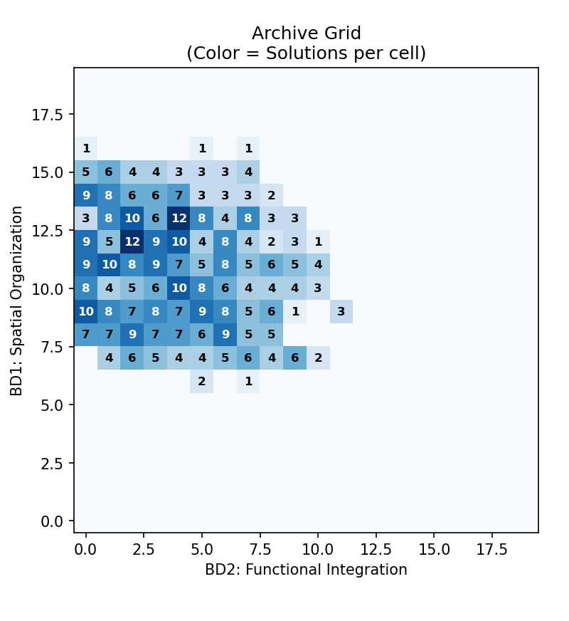
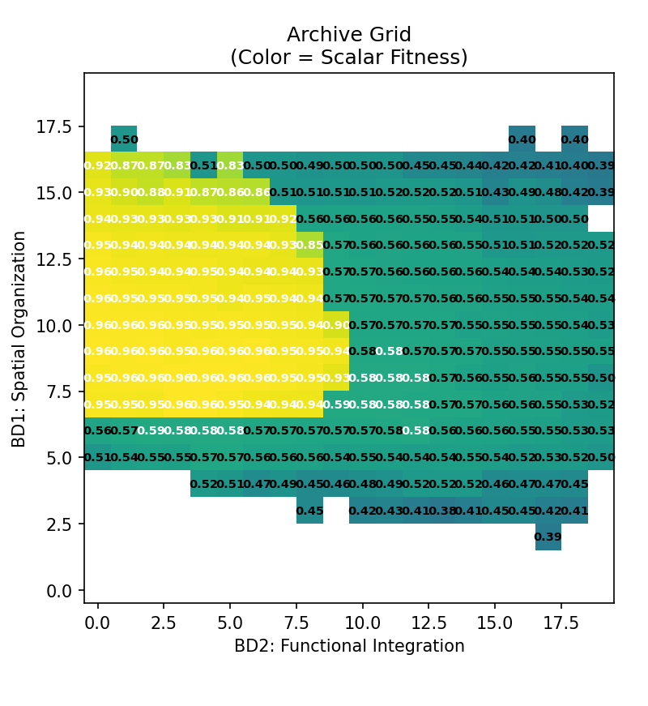
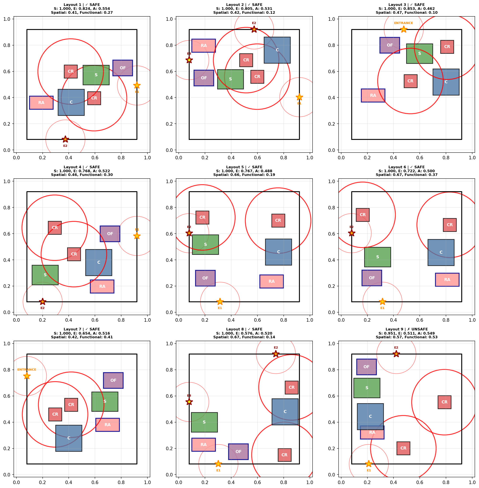
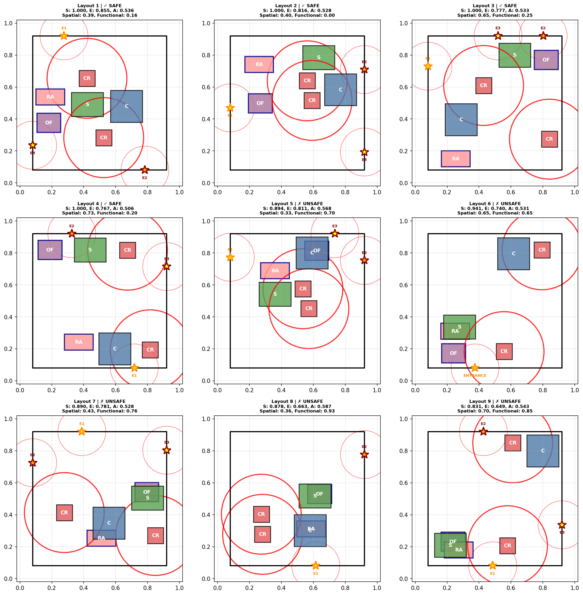
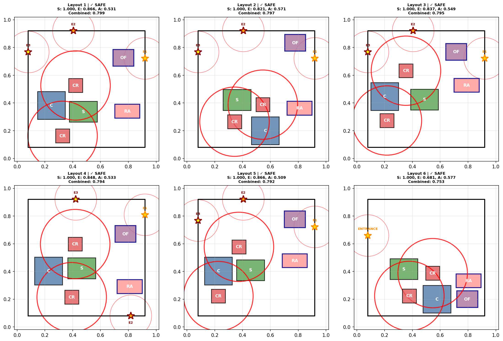

# CSLP-Elites


[](assets/poster.pdf.pdf)
[](assets/model.png)

[](https://github.com/ClanPing/CSLP-Elites-App.git)


**Hybrid Quality-Diversity Framework for Construction Site Layout Planning (CSLP)**
This project presents CSLP-Elites, a hybrid optimization framework that integrates MAP-Elites an NSGA-II to generate diverse and high-performing construction site layouts.

## 🎯 Key features
- **Three optimization algorithms** with comparative modes
- **Multi-objective optimization** (3 objectives: Safety, Efficiency, Adaptability)
- **Behavioral diversity exploration** (2D behavioral space: Compactness-Spread × Worker-Operational Separation)
- **Comprehensive visualization** and analysis tools
- **Modular architecture** for easy extension and experimentation

## 📁 Project structure
```
CSLP-Elites/
│
├── core/                            # Python package with reusable modules
│   ├── __init__.py                  # Package exports
│   ├── config.py                    # Configurations and data structures
│   ├── objectives.py                # Objective functions for NSGA-II
│   ├── behavioral_descriptors.py    # Behavioral descriptors for MAP-Elites
│   ├── layout_generation.py         # Layout generation and genetic operators
│   ├── visualization.py             # Visualization and export functions
│   ├── cslpelites_algorithm.py      # CSLP Elite (MAP-Elites + NSGA-II)
│   ├── mapelites_algorithm.py       # Pure MAP-Elites with scalar fitness
│   └── nsga2_algorithm.py           # Pure NSGA-II multi-objective

├── output/                          # Output directory (generated)
│   ├── cslpelites/                  # CSLP Elite results
│   ├── mapelites/                   # MAP-Elites results
│   └── nsga2/                       # NSGA-II results

[Runnable Scripts]
│   ├── run_cslpelites.py            # Run CSLP Elite hybrid algorithm
│   ├── run_mapelites.py             # Run pure MAP-Elites
│   └── run_nsga2.py                 # Run pure NSGA-II

[Others]
│   ├── assets/                      # Medias used in the repository
│   ├── environment.yml              # Conda environment specification
│   ├── INFO.md                      # Project information
│   └── README.md                    # This file
```

## 📋 Project information
For the detailed problem formulation of CSLP-Elites, please refer to this [documentation](INFO.md) which include how layouts are generated, evaluated, and categorised.

This section includes:
- Layout Configurations: Rules for facility selection, placement, and spatial combinations.
- Feasibility Constraints: Boundary and overlap checks ensuring valid site layouts.
- Objective Functions: Multi-objective formulations for safety, efficiency, and adaptability.
- Behavioural Descriptors: Metrics defining diversity dimensions such as compactness–spread and worker–operational separation.

## Installation

Start by cloning this repository:
```bash
git clone https://github.com/ClanPing/CSLP-Elites.git
cd CSLP-Elites
```

Next, install the dependencies:
```bash
conda env create -f environment.yml
conda activate cslpelites
```

## Quick start

### **CSLP-Elites**: `run_cslpelites.py`

Combines behavioral diversity exploration with multi-objective optimization.

**Basic Usage**:
```powershell
# Default run (6 facilities, 15000 iterations, 20×20 grid)
python run_cslpelites.py --visualize

# Quick test (reduced parameters for validation)
python run_cslpelites.py --test --visualize

# Production run with custom parameters
python run_cslpelites.py --facilities 7 --iterations 25000 --grid-size 25 --pareto-size 15 --visualize
```

**Command-Line Arguments**:

**Core Parameters**:
- `--facilities N`: Number of facilities (3-8, default: 6)
  - **Range**: 3 (minimum) to 8 (maximum)
  - **Default**: 6 facilities
  - **Facility types**: Auto-selected from 5 available types (see Module 1 for details)
  - **Selection**: Smart mix ensures realistic site composition
  - Lower counts → faster optimization, higher counts → more complex layouts
- `--iterations N`: Evolution iterations (default: 15000)
- `--init-pop N`: Initial population size (default: 500)

**Archive Configuration**:
- `--grid-size N`: Grid size per dimension (10-30, default: 20)
  - Total cells = N²  (e.g., 20×20 = 400 cells)
- `--pareto-size N`: Max Pareto front size per cell (5-25, default: 12)

**Site Configuration**:
- `--min-entrances N`: Minimum entrances (1-6, default: 1)
- `--max-entrances N`: Maximum entrances (1-6, default: 3)
- `--margin F`: Boundary margin (default: 0.08)
- `--entrance-clearance F`: Entrance clearance distance (default: 0.15)
- `--crane-safety F`: Crane safety distance (default: 0.30)

**Output Options**:
- `--output-dir DIR`: Output directory (default: `output/cslpelites`)
- `--export-count N`: Number of layouts to export (default: 25)
- `--visualize`: Create visualizations (flag)
- `--seed N`: Random seed (default: 42)
- `--test`: Run quick test mode (flag)

**Examples**:
```powershell
# Large complex site
python run_cslpelites.py --facilities 8 --iterations 30000 --grid-size 30 --visualize

# Strict safety requirements
python run_cslpelites.py --margin 0.1 --entrance-clearance 0.20 --crane-safety 0.40 --visualize

# High diversity exploration
python run_cslpelites.py --grid-size 25 --pareto-size 20 --init-pop 800 --visualize

# Reproducible run with specific seed
python run_cslpelites.py --seed 123 --facilities 6 --iterations 15000 --visualize
```

**Output Files** (example):
- `outut/cslpelites`
  - `cslpelite_layout_000.json` to `cslpelite_layout_024.json`: Individual layouts
  - `cslpelite_summary.json`: Overall statistics
  - `cslpelite_evaluation.json`: Archive performance metrics
  - `behavioral_analysis.json`: Behavioral region analysis
  - `cslpelite_analysis.png`: Multi-panel visualization
  - `cslpelite_layouts.png`: Layout gallery

## Comparisons
We compare CSLP-Elites with pure MAP-Elites, and pure NSGA-II.
### **Pure MAP-Elites**: `run_mapelites.py`
Behavioral diversity with scalar fitness.

**Basic Usage**:
```powershell
# Default run
python run_mapelites.py --visualize

# Quick test
python run_mapelites.py --test --visualize

# Custom fitness weights
python run_mapelites.py --safety-weight 0.6 --efficiency-weight 0.25 --adaptability-weight 0.15 --visualize
```

**Command-Line Arguments**:
*(Similar to CSLP Elite, plus:)*
- Default output directory: `output/mapelites`

**Scalar Fitness Weighting**:
- `--safety-weight F`: Weight for safety (default: 0.5)
- `--efficiency-weight F`: Weight for efficiency (default: 0.3)
- `--adaptability-weight F`: Weight for adaptability (default: 0.2)
  - Note: Weights must sum to 1.0 (auto-normalized if not)

**Examples**:
```powershell
# Prioritize safety heavily
python run_mapelites.py --safety-weight 0.7 --efficiency-weight 0.2 --adaptability-weight 0.1 --visualize

# Fast exploration (smaller grid)
python run_mapelites.py --grid-size 15 --iterations 10000 --visualize

# Balanced objectives
python run_mapelites.py --safety-weight 0.33 --efficiency-weight 0.33 --adaptability-weight 0.34 --visualize
```

**Output Files**:
- `output/mapelites`
  - `mapelites_layout_000.json` to `mapelites_layout_024.json`
  - `mapelites_summary.json`
  - `mapelites_evaluation.json`
  - `behavioral_analysis.json`
  - `mapelites_analysis.png`
  - `mapelites_layouts.png`

### **Pure NSGA-II**: `run_nsga2.py`
Multi-objective Pareto optimization only.

**Basic Usage**:
```powershell
# Default run (200 pop, 300 generations)
python run_nsga2.py --visualize

# Quick test
python run_nsga2.py --test --visualize

# High-quality convergence
python run_nsga2.py --population 400 --generations 600 --visualize
```

**Command-Line Arguments**:

**Core Parameters**:
- `--facilities N`: Number of facilities (3-8, default: 6)
- `--population N`: Population size (default: 200)
- `--generations N`: Number of generations (default: 300)

**NSGA-II Specific**:
- `--tournament-size N`: Tournament selection size (default: 3)
- `--crossover-rate F`: Crossover probability (default: 0.8)
- `--mutation-rate F`: Mutation probability (default: 0.4)

**Site Configuration**: (Same as CSLP Elite)
- `--min-entrances`, `--max-entrances`, `--margin`, `--entrance-clearance`, `--crane-safety`

**Output Options**:
- `--output-dir DIR`: Output directory (default: `output/nsga2`)
- `--export-count N`: Number of layouts to export (default: 25)
- `--visualize`, `--seed`, `--test`

**Examples**:
```powershell
# Large population for better convergence
python run_nsga2.py --population 400 --generations 500 --visualize

# High selection pressure
python run_nsga2.py --tournament-size 5 --crossover-rate 0.9 --mutation-rate 0.3 --visualize

# Extended optimization
python run_nsga2.py --population 300 --generations 800 --visualize

# Complex site
python run_nsga2.py --facilities 8 --population 400 --generations 600 --visualize
```

**Output Files**:
- `output/nsga2`
  - `nsga2_layout_000.json` to `nsga2_layout_024.json`
  - `nsga2_summary.json`
  - `nsga2_detailed_metrics.json`
  - `nsga2_analysis.png`
  - `nsga2_pareto_layouts.png`

---
### Comparative Performance of CSLP-Elites vs Baseline Models
This section summarises the comparative evaluation between **CSLP-Elites**, **MAP-Elites**, and **NSGA-II** under identical experimental settings:
- **Problem setup:** 6 facilities, 20×20 behavioural grid (400 cells)  
- **Objectives:** Safety, Efficiency, Adaptability  
- **Iterations:** 15 000  
- **Safety threshold:** ≥ 0.7

#### 📊 Algorithm Overview

| Aspect | **CSLP-Elites** | **MAP-Elites** | **NSGA-II** |
|--------|---------------------------|-----------------------------|--------------------------|
| **Optimisation Approach** | Multi-objective + behavioural diversity | Scalar fitness + behavioural diversity | Multi-objective only |
| **Output Structure** | 2D behavioural **grid of Pareto fronts** | 2D behavioural grid (single elite per cell) | Single global Pareto front |
| **Solution Count (observed)** | **535 solutions** (Pareto sets in 221 cells) | 268 solutions (1 per cell) | 195 Pareto solutions |
| **Behavioural Exploration** | **Strong, structured** | High but unconstrained | Very limited |
| **Constraint Handling** | **Strict (100% feasible)** | Moderate (92% feasible) | Weak (4% feasible) |
| **Trade-off Representation** | **Multiple Pareto solutions per cell** | None (weighted sum) | Good, but only in objective space |
| **Layout Diversity** | **High + safety-compliant** | High but often infeasible | Low (layouts look almost identical) |
| **Best Use Case** | Balanced exploration + safe deployable layouts | Exploring wide spatial patterns | Pure objective optimisation |

#### 📈 Quantitative Comparison

| Algorithm | Feasible Solutions (%) | Behavioural Coverage (%) | Distinct Layouts | Avg Safety | Avg Efficiency | Avg Adaptability |
|:-----------|:----------------------:|:-----------------------:|:----------------:|:-----------:|:---------------:|:----------------:|
| **CSLP-Elites** | **100 (535/535)** | 55.3 | 221 | **0.989** | 0.695 | 0.515 |
| **MAP-Elites** | 92 (247/268) | **67.0** | 268 | 0.897 | 0.733 | 0.545 |
| **NSGA-II** | 4 (8/195) | ~7.6 (est.) | 195 | 0.859 | **0.863** | **0.588** |

**Summary:**  
- **CSLP-Elites** achieves the best overall balance: full feasibility, strong diversity, and meaningful Pareto trade-offs.  
- **MAP-Elites** explores more behavioural cells but at the cost of constraint violations.  
- **NSGA-II** optimises objectives well but lacks behavioural diversity and feasibility.

#### 🪟 Behavioural-Archive Comparison

<div align="center">

| **CSLP-Elites** | **MAP-Elites** |
|-----------------|----------------|
| <p align="center"></p> | <p align="center"></p> |

</div>

CSLP-Elites and MAP-Elites both populate a 20×20 behavioural grid, but with different characteristics:

- **MAP-Elites** fills more cells (268) but includes many infeasible or unrealistic layouts.  
- **CSLP-Elites** focuses on **feasible high-value regions**, producing **multiple Pareto-optimal solutions per cell**, offering meaningful trade-offs for decision-making.

#### 🏗️ Example Layout Showcase

| **CSLP-Elites** | **MAP-Elites** | **NSGA-II** |
|-----------------|----------------|--------------|
|  |  |  |

A visual inspection of representative layouts highlights key differences:

- **NSGA-II** → produces nearly identical layouts with subtle coordinate shifts (low geometric variety).  
- **MAP-Elites** → generates diverse layouts, but many violate safety constraints or contain overlaps.  
- **CSLP-Elites** → delivers diverse **and** fully safety-compliant layouts, covering compact, moderate, and distributed patterns.
