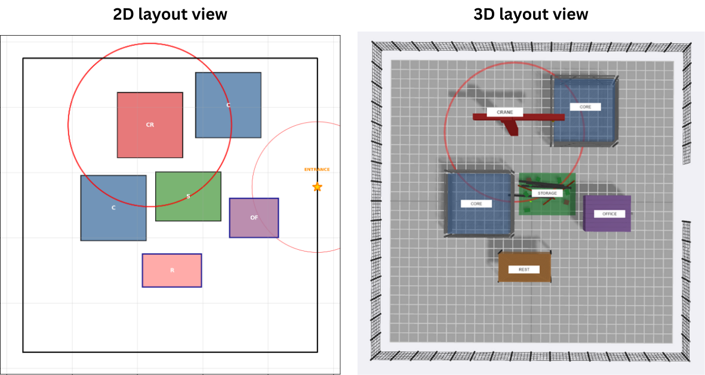

# CEXO


[](assets/poster.pdf)
[](assets/model.png)

[](https://github.com/ClanPing/CSLP-Elites-App.git)

[](https://doi.org/10.5281/zenodo.18426345)

**Construction Site eXploration and Optimisation (CEXO)** is a hybrid quality-diversity framework for construction site layout planning. It integrates MAP-Elites, NSGA-II-style Pareto selection, genetic variation operators, and optional autoencoder-learned behavioral descriptors to generate diverse, high-performing, and safety-aware construction site layouts.

The repository keeps the standard CEXO workflow, baseline algorithms, export tools, visual analysis assets, and the new Bulleen practical case-study pathway in one main codebase.

## Key Features

- **Three optimization pathways** with direct comparison modes
- **Multi-objective optimization** for safety, operational efficiency, and layout adaptability
- **Quality-diversity exploration** through a 2D behavioral archive
- **Per-cell Pareto fronts** for preserving multiple trade-off layouts in each behavioral niche
- **Genetic algorithm operators** for mutation, crossover, targeted generation, and repair
- **Optional learned behavioral descriptors** using an autoencoder latent space
- **Bulleen practical case-study support** with fixed facility mix, irregular site boundary, entrances, and road/access exclusion corridors
- **Comprehensive visualization and JSON export tools** for downstream analysis and app integration

## Project Structure

```text
CEXO/
|
+-- core/                            # Python package with reusable modules
|   +-- __init__.py                  # Package exports
|   +-- config.py                    # Configurations, facility data, Bulleen helpers
|   +-- objectives.py                # Safety, efficiency, and adaptability objectives
|   +-- behavioral_descriptors.py    # Hand-crafted and learned descriptor manager
|   +-- layout_generation.py         # Layout generation, repair, and genetic operators
|   +-- layout_autoencoder.py        # Autoencoder model and trainer
|   +-- visualization.py             # Visualization and export functions
|   +-- cexo_algorithm.py            # CEXO optimizer
|   +-- cslpelites_algorithm.py      # Compatibility import shim
|   +-- mapelites_algorithm.py       # Pure MAP-Elites baseline
|   +-- mapelites_with_autoencoder.py # Compatibility helper for learned MAP-Elites imports
|   +-- nsga2_algorithm.py           # Pure NSGA-II baseline
|
+-- assets/                          # Figures and media used in the repository
+-- output/                          # Generated outputs, ignored by Git
|
+-- run_cexo.py                      # Official CEXO runner
+-- run_cslpelites.py                # Compatibility runner
+-- run_mapelites.py                 # Pure MAP-Elites runner
+-- run_nsga2.py                     # Pure NSGA-II runner
|
+-- environment.yml                  # Conda environment specification
+-- INFO.md                          # Detailed problem formulation
+-- README.md                        # This file
```

`run_cexo.py` is the official entry point. Compatibility wrappers remain so older local scripts and downstream tools can continue to run while the public project naming is CEXO.

## Project Information

For the detailed problem formulation, please refer to [INFO.md](INFO.md), which explains how layouts are generated, evaluated, constrained, and categorized.

That document covers:

- Layout configurations: facility selection, placement, and spatial combinations
- Feasibility constraints: boundary, overlap, clearance, and practical site checks
- Objective functions: safety, efficiency, and adaptability
- Behavioral descriptors: diversity dimensions for archive organization

## Installation

Clone the repository:

```powershell
git clone https://github.com/ClanPing/CEXO.git
cd CEXO
```

Create the Conda environment:

```powershell
conda env create -f environment.yml
conda activate cexo
```

On Windows terminals that use a legacy code page, run scripts with Python UTF-8 mode:

```powershell
python -X utf8 run_cexo.py --test
```

## Quick Start

### CEXO: `run_cexo.py`

CEXO combines behavioral diversity exploration with multi-objective optimization. In the default v2 workflow, the optimizer first builds an unbiased training pool, trains an autoencoder, then organizes layouts in the MAP-Elites archive using learned behavioral descriptors.

```powershell
# Small validation run
python -X utf8 run_cexo.py --test --output output/cexo_test

# Standard learned-descriptor run
python -X utf8 run_cexo.py --facilities 6 --iterations 15000 --initial-pop 500 --output output/cexo

# Hand-crafted descriptor mode
python -X utf8 run_cexo.py --facilities 6 --iterations 15000 --initial-pop 500 --no-learned --output output/cexo_handcrafted
```

<details>
<summary><span style="font-weight: bold;">Detailed CEXO arguments and outputs</span></summary>

**Core parameters**

- `--facilities N`: Number of facilities for the standard synthetic case
- `--iterations N`: Evolution iterations
- `--initial-pop N` or `--init-pop N`: Initial training/evaluation pool size
- `--seed N`: Random seed for reproducibility
- `--test`: Run a small smoke test

**Descriptor learning**

- `--no-learned`: Disable autoencoder descriptors and use hand-crafted behavioral descriptors
- `--pretrain N`: Number of pretraining layouts/iterations before learned descriptor archive construction
- `--train-freq N`: Retraining frequency
- `--latent-dim N`: Latent dimension, normally 2 for MAP-Elites archiving

**Output**

- `--output DIR` or `--output-dir DIR`: Output directory
- Main CEXO files include `results.json`, `cexo_summary.json`, `cexo_layout_*.json`, `archive_heatmap.png`, `best_layout.png`, `diverse_layouts.png`, and optional `training_history.png`
- Compatibility copies are also written for older local analysis and visualization tools

</details>

## Bulleen Case Study

The v2 branch adds a practical Bulleen pathway for testing CEXO on a more constrained and realistic site setup. This includes:

- Fixed or sampled practical facility mixes
- Approximate irregular site boundary
- Fixed entrance/access points
- Road and access corridor exclusion zones
- Export scaling through site width and length parameters

```powershell
# Bulleen practical-case smoke test
python -X utf8 run_cexo.py --test --practical-bulleen --bulleen-boundary --bulleen-entrances --bulleen-roads --output output/bulleen_test

# Longer Bulleen run
python -X utf8 run_cexo.py --practical-bulleen --bulleen-boundary --bulleen-entrances --bulleen-roads --iterations 15000 --initial-pop 500 --output output/bulleen
```

Useful Bulleen options:

- `--practical-bulleen`: Use the fixed Bulleen practical-case facility mix
- `--sample-bulleen`: Sample facility counts from Bulleen practical-case ranges
- `--bulleen-boundary`: Use the approximate irregular Bulleen site polygon
- `--bulleen-entrances`: Use fixed Bulleen entrance/access points
- `--bulleen-roads`: Use approximate road/access corridors as exclusion zones
- `--site-width-m F` and `--site-length-m F`: Export dimensions for scaled downstream visualization

## Baseline Comparisons

CEXO is designed to be compared against pure MAP-Elites and pure NSGA-II under similar experimental settings.

### Pure MAP-Elites: `run_mapelites.py`

Pure MAP-Elites explores behavioral diversity with a scalar fitness function.

```powershell
# Default run
python -X utf8 run_mapelites.py --visualize

# Quick test
python -X utf8 run_mapelites.py --test --visualize

# Custom fitness weights
python -X utf8 run_mapelites.py --safety-weight 0.6 --efficiency-weight 0.25 --adaptability-weight 0.15 --visualize
```

<details>
<summary><span style="font-weight: bold;">Detailed MAP-Elites arguments and outputs</span></summary>

**Core parameters**

- `--facilities N`: Number of facilities, default 6
- `--iterations N`: Evolution iterations
- `--init-pop N`: Initial population size
- `--grid-size N`: Grid size per behavioral dimension

**Scalar fitness weighting**

- `--safety-weight F`: Weight for safety
- `--efficiency-weight F`: Weight for efficiency
- `--adaptability-weight F`: Weight for adaptability

**Output files**

- `mapelites_layout_*.json`
- `mapelites_summary.json`
- `mapelites_evaluation.json`
- `behavioral_analysis.json`
- `mapelites_analysis.png`
- `mapelites_layouts.png`

</details>

### Pure NSGA-II: `run_nsga2.py`

Pure NSGA-II performs multi-objective Pareto optimization without behavioral descriptors.

```powershell
# Default run
python -X utf8 run_nsga2.py --visualize

# Quick test
python -X utf8 run_nsga2.py --test --visualize

# Larger convergence run
python -X utf8 run_nsga2.py --population 400 --generations 600 --visualize
```

<details>
<summary><span style="font-weight: bold;">Detailed NSGA-II arguments and outputs</span></summary>

**Core parameters**

- `--facilities N`: Number of facilities, default 6
- `--population N`: Population size
- `--generations N`: Number of generations

**NSGA-II parameters**

- `--tournament-size N`: Tournament selection size
- `--crossover-rate F`: Crossover probability
- `--mutation-rate F`: Mutation probability

**Output files**

- `nsga2_layout_*.json`
- `nsga2_summary.json`
- `nsga2_detailed_metrics.json`
- `nsga2_analysis.png`
- `nsga2_pareto_layouts.png`

</details>

## Methodology

CEXO follows seven main steps:

1. Define the construction site, facility set, entrances, boundaries, and exclusion zones.
2. Generate candidate layouts using seeded random generation and targeted generation.
3. Evaluate each layout with safety, operational efficiency, and adaptability objectives.
4. Learn a two-dimensional behavioral space with an autoencoder, or use hand-crafted behavioral descriptors.
5. Place layouts into a MAP-Elites archive based on behavioral descriptors.
6. Maintain a bounded Pareto front inside each occupied cell using NSGA-II-style dominance and crowding-distance logic.
7. Continue genetic evolution with mutation, crossover, diversity targeting, and repair operators.

This means CEXO preserves both:

- **Quality**: high-performing layouts across multiple objectives
- **Diversity**: a broad set of behaviorally distinct site layouts

## Comparative Performance

This section summarizes the comparison between **CEXO**, **MAP-Elites**, and **NSGA-II** under the standard benchmark setting:

- Problem setup: 6 facilities, 20x20 behavioral grid
- Objectives: safety, efficiency, adaptability
- Iterations: 15,000
- Safety threshold: >= 0.7

### Algorithm Overview

| Aspect | **CEXO** | **MAP-Elites** | **NSGA-II** |
|--------|----------|----------------|-------------|
| Optimization approach | Multi-objective + behavioral diversity | Scalar fitness + behavioral diversity | Multi-objective only |
| Output structure | Behavioral grid of Pareto fronts | Behavioral grid with one elite per cell | Single global Pareto front |
| Trade-off representation | Multiple Pareto solutions per cell | Weighted-sum only | Pareto front only |
| Behavioral exploration | Strong and structured | High but less constrained | Limited |
| Constraint handling | Safety-aware archive selection | Scalar penalty based | Objective-space selection |
| Best use case | Balanced exploration with deployable alternatives | Wide spatial pattern discovery | Objective trade-off search |

### Quantitative Comparison

| Algorithm | Feasible Solutions (%) | Behavioral Coverage (%) | Distinct Layouts | Avg Safety | Avg Efficiency | Avg Adaptability |
|:----------|:----------------------:|:-----------------------:|:----------------:|:----------:|:--------------:|:----------------:|
| **CEXO** | **100 (535/535)** | 55.3 | 221 | **0.989** | 0.695 | 0.515 |
| **MAP-Elites** | 92 (247/268) | **67.0** | 268 | 0.897 | 0.733 | 0.545 |
| **NSGA-II** | 4 (8/195) | ~7.6 | 195 | 0.859 | **0.863** | **0.588** |

**Summary**

- **CEXO** achieves the strongest balance between feasibility, diversity, and multi-objective trade-off representation.
- **MAP-Elites** explores many behavioral cells, but can include less feasible layouts when objectives are reduced to a scalar fitness.
- **NSGA-II** optimizes the objective trade-off directly, but does not preserve broad behavioral diversity.

## Behavioral Archive Comparison

<div align="center">

| **CEXO** | **MAP-Elites** |
|----------|----------------|
| <p align="center"></p> | <p align="center"></p> |

</div>

CEXO and MAP-Elites both populate a 20x20 behavioral grid, but they differ in how quality is stored:

- **MAP-Elites** keeps one best scalar-fitness layout per occupied behavioral cell.
- **CEXO** keeps a bounded Pareto set per occupied cell, allowing multiple high-quality trade-off layouts in the same behavioral region.

## Layout Showcase

### 2D Layouts

| **CEXO** | **MAP-Elites** | **NSGA-II** |
|----------|----------------|-------------|
|  |  |  |

Representative layouts highlight the practical difference between approaches:

- **NSGA-II** tends to produce similar-looking layouts with subtle coordinate shifts.
- **MAP-Elites** generates diverse spatial patterns, but some may violate site constraints.
- **CEXO** aims to preserve layout diversity while maintaining safety-aware, multi-objective trade-offs.

### 3D Layouts

<p align="center">

</p>

The 2D-to-3D Streamlit visualization workflow is maintained separately and can be updated after the main CEXO repository is stable:

[Streamlit dashboard repository](https://github.com/ClanPing/CSLP-Elites-App.git)

## Output Files

CEXO writes generated files under `output/`, which is ignored by Git.

Typical CEXO outputs include:

- `results.json`: run configuration, timing, and summary statistics
- `cexo_summary.json`: archive and objective summary
- `cexo_layout_*.json`: exported layout candidates
- `archive_heatmap.png`: behavioral archive heatmap
- `best_layout.png`: best exported layout
- `diverse_layouts.png`: representative layouts across the archive
- `training_history.png`: autoencoder reconstruction-loss history, when learned descriptors are enabled
- compatibility copies for older local analysis or dashboard readers

## Current Repository Direction

The current v2 branch keeps the main repository focused on the core research code:

- Standard CEXO experiments
- Bulleen practical case study
- MAP-Elites and NSGA-II baselines
- Export formats for future app visualization

The Streamlit dashboard remains separate for now. Once the main v2 code and case-study outputs are stable, the dashboard can be updated to read both standard CEXO and Bulleen outputs.

## License

MIT License.
