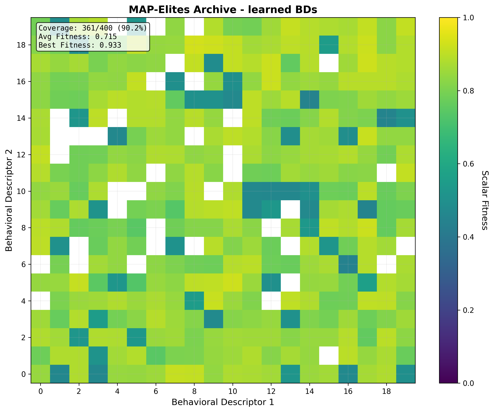
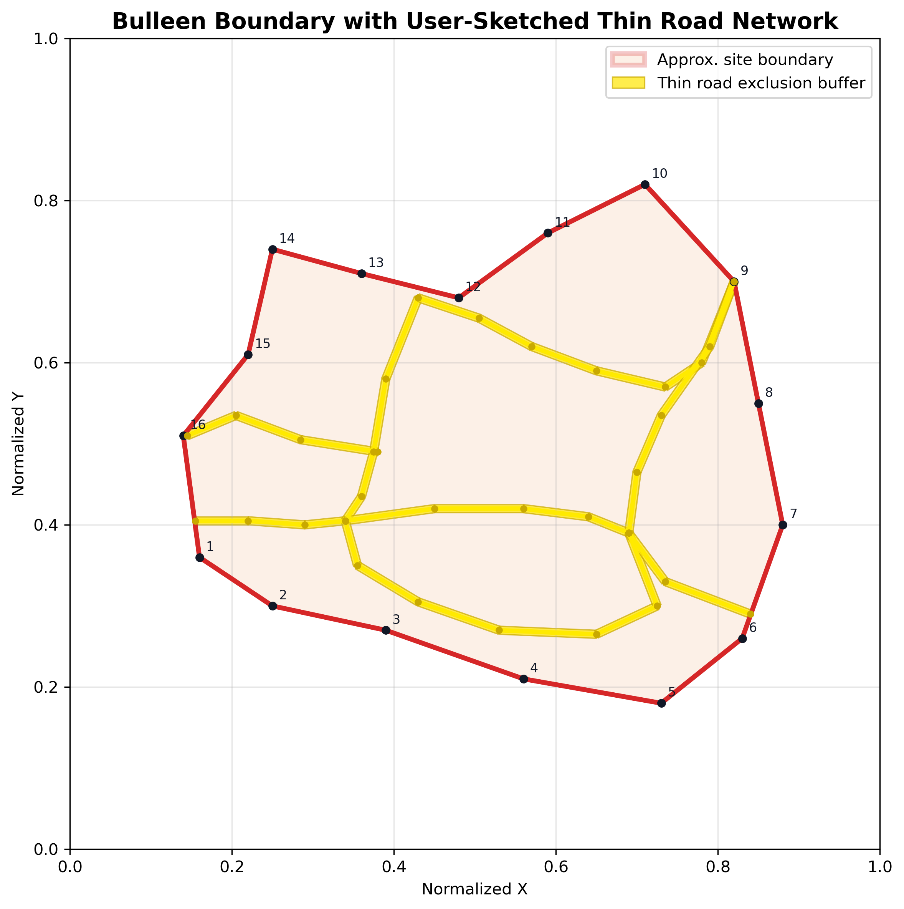
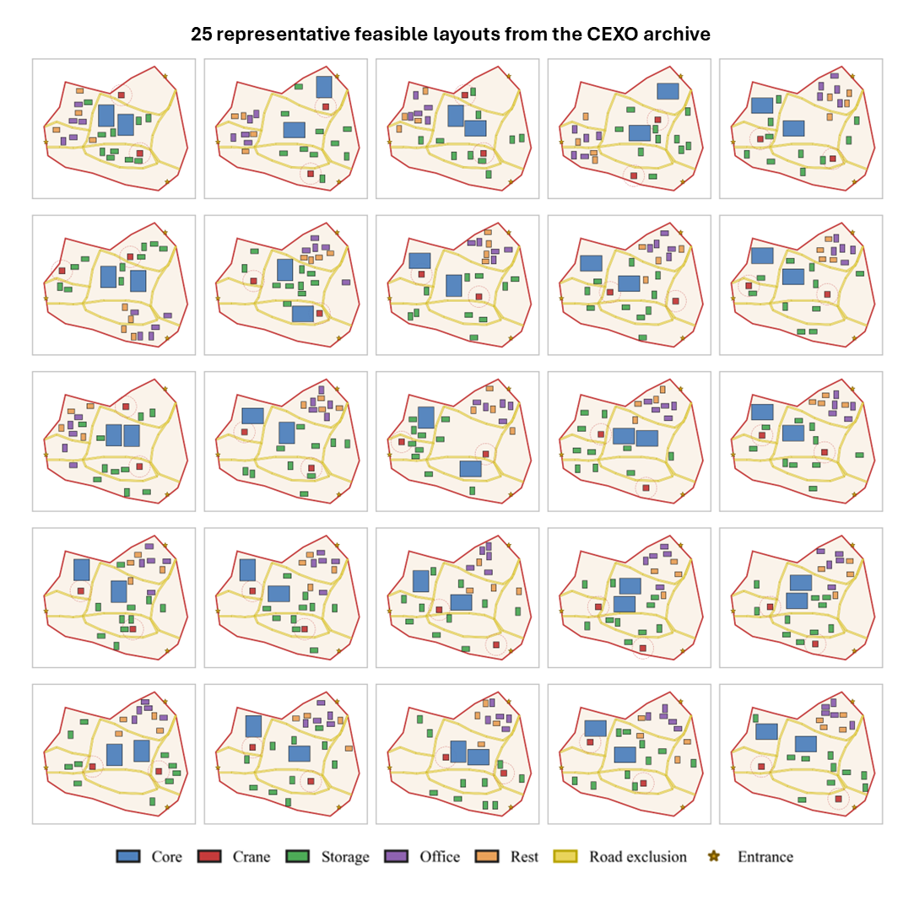

# CEXO


[](assets/poster.pdf)
[](assets/model.png)

[](https://github.com/ClanPing/CSLP-Elites-App.git)

[](https://doi.org/10.5281/zenodo.18426345)

**Construction Site eXploration and Optimisation (CEXO)**

This project presents CEXO, a hybrid optimization framework that integrates MAP-Elites and NSGA-II to generate diverse and high-performing construction site layouts.

🔗 **Streamlit Dashboard Application for CEXO**: [🚧UNDER CONSTRUCTION🚧]

## 🎯Key Features
- **Three optimization algorithms** with comparative modes
- **Multi-objective optimization** (3 objectives: Safety, Efficiency, Adaptability)
- **Behavioral diversity exploration** (Autoencoder training included for learned behavioural descriptors)
- **Comprehensive visualization** and analysis tools
- **Modular architecture** for easy extension and experimentation

## 📁Project Structure

```
CEXO/
├── analysis/                        # Analysis scripts for reproducibility, sensitivity, scalability, and ablation study
├── assets/                          # Medias used in the repository
├── core/                            # Python package with main modules to run the model
├── examples/                        # Practical Bulleen case study using the same CEXO method with different site setup parameters
├── .gitignore
├── INFO.md                          # Project information
├── LICENSE
├── README.md                        # This file
├── main.py                          # Main entry point for running the CEXO workflow
├── requirements.txt                 # Dependencies for Conda environment
```

## 📋Project Information

For the detailed problem formulation, please refer to [INFO.md](INFO.md), which explains how layouts are generated, evaluated, constrained, and categorized.

That document covers:

- Layout configurations: facility selection, placement, and spatial combinations
- Feasibility constraints: boundary, overlap, clearance, and practical site checks
- Objective functions: safety, efficiency, and adaptability
- Behavioral descriptors: diversity dimensions for archive organization

## 📥Installation

Clone the repository:

```powershell
git clone https://github.com/ClanPing/CEXO.git
cd CEXO
```

Create the Conda environment:

```powershell
conda create --name cexo python=3.9
conda activate cexo
pip install -r requirements.txt
```

## 🚀Quick Start
🔹**CEXO**: Multi-objective optimisation + Quality-diversity algorithm.
```powershell
python main.py --facilities 5 --iterations 1000 --initial-pop 100 --seed 42 --visualize
```

CEXO can be compared against two baseline methods:

🔹**NSGA-II**: Multi-objective optimisation only.
```powershell
python run_nsga2.py --facilities 5 --population 200 --generations 300 --seed 42 --visualize
```

🔹**MAP-Elites**: Quality-diversity algorithm only.
```powershell
python run_mapelites.py --facilities 5 --iterations 15000 --initial-pop 500 --seed 42 --visualize
```

<details>
<summary><span style="font-weight: bold;">Detailed command arguments and outputs: (Click here to expand)</span></summary>

1️⃣**Core parameters**

| Argument | Default | Purpose | Example |
|---|---:|---|---|
| `--facilities` | `5` | Sets the total number of facilities when using the automatic facility mix. | `--facilities 6` |
| `--facility-mix` | Auto-generated | Manually sets the exact facility types and counts. Overrides `--facilities`. | `--facility-mix core=2,crane=1,storage=2,office=1,rest_area=1` |
| `--iterations` | `10000` | Sets the number of CEXO optimisation iterations. | `--iterations 15000` |
| `--initial-pop` | `500` | Sets the initial population size before optimisation begins. | `--initial-pop 800` |
| `--seed` | `42` | Sets the random seed for reproducible layout generation and optimisation. | `--seed 123` |
| `--no-learned` | `False` | Uses hand-crafted behavioural descriptors instead of autoencoder-learned descriptors. | `--no-learned` |
| `--pretrain` | `2000` | Sets how many iterations occur before autoencoder descriptor training begins. | `--pretrain 3000` |
| `--train-freq` | `1000` | Sets how often the autoencoder descriptors are retrained. | `--train-freq 500` |
| `--latent-dim` | `2` | Sets the latent descriptor dimension used by the autoencoder. | `--latent-dim 2` |
| `--output` | `results` | Sets the folder where run outputs are saved. | `--output output/cexo_test` |

2️⃣**Facility mix**

CEXO supports two ways to define the facility mix.
| Mode | Command | Behaviour |
|---|---|---|
| Automatic mix | `--facilities 5` | CEXO automatically creates a practical facility mix based on the total facility count and `--seed`. |
| Manual mix | `--facility-mix core=2,crane=1,storage=2,office=1,rest_area=1` | The exact facility types and counts are fixed by the user. This overrides `--facilities`. |

Valid facility types are: `core`, `crane`, `storage`, `office`, `rest_area`

Automatic facility selection follows this rule:
| Facility count | Selection rule |
|---|---|
| 3 | Includes `core`, `crane`, and `storage`. |
| 4 | Includes `core`, `crane`, `storage`, plus one extra operational facility. |
| 5 | Includes `core`, `crane`, `storage`, `office`, and `rest_area`. |
| >5 | Adds extra operational facilities selected from `core`, `storage`, and `crane`. |
```
Examples
# Automatic facility mix
python main.py --facilities 5 --seed 42

# Manual facility mix
python main.py --facility-mix core=2,crane=1,storage=2,office=1,rest_area=1 --seed 42
```

3️⃣**Output**

Additional command-line argument for output results.
| Argument | Purpose |
|---|---|
| `--visualize` | Exports individual final archive layouts as JSON files and PNG previews. |
| `--export-count 50` | Exports up to 50 layouts. |
| `--export-all` | Exports every final archived layout. |
| `--no-export-pngs` | Exports JSON files only. |
| `--export-unsafe` | Includes layouts with recorded feasibility violations. |

Results can be found under `results` folder upon finishing the run.
| Output | Selection rule |
|---|---|
| `results.json` | Main run summary, including parameters, facility mix, archive stats, objective scores, runtime. |
| `archive_heatmap.png` | Behavioural archive heatmap showing occupied cells and quality distribution. |
| `best_layout.png` | Best layout selected from the final archive. |
| `diverse_layouts.png` | Representative layouts sampled from different behavioural regions. |
| `training_history.png` | Autoencoder training progress, generated when learned behavioural descriptors are used. |

</details>

```powershell
# Show all available command-line options:
python main.py --help
python run_mapelites.py --help
python run_nsga2.py --help
```

## 📈Analysis
We have three major analysis: `reproducibility`, `scalability`, and `sensitivity`. Additionally, an ablation study is conducted for CEXO against the two baseline methods (NSGA-II, MAP-Elites).

```powershell
# All analysis workflows can be launched from the repository root using:
python analysis.py --help
```

### Comparative Performance

This section summarises the comparative evaluation between **CEXO**, **MAP-Elites**, and **NSGA-II** under identical experimental settings:

- Problem setup: 6 facilities
- Behavioural archive: 20x20 behavioral grid (400 cells)
- Objectives: safety, efficiency, adaptability
- Iterations: 15,000
- Safety threshold: >= 0.7
- Seed: 42
- CEXO / MAP-Elites: 500 initial layouts + 15,000 optimisation iterations
- NSGA-II: population 100 x 150 generations, with a comparable number of evaluated layouts

#### 1️⃣Algorithm Overview

| Aspect | **CEXO** | **MAP-Elites** | **NSGA-II** |
|--------|----------|----------------|-------------|
| Optimization approach | Multi-objective + behavioral diversity | Scalar fitness + behavioral diversity | Multi-objective only |
| Output structure | Behavioral grid of Pareto fronts | Behavioral grid with one elite per cell | Single global Pareto front |
| Trade-off representation | Multiple Pareto solutions per cell | Weighted scalar fitness | Pareto front in objective space |
| Behavioral exploration | Strong and structured | High but not Pareto-structured | Limited |
| Constraint handling | Safety-aware archive selection | Scalar penalty based | Objective-space selection |
| Best use case | Balanced exploration with deployable alternatives | Wide spatial pattern discovery | Objective trade-off search |

#### 2️⃣Quantitative Comparison

| Algorithm | Feasible Solutions (%) | Behavioral Coverage (%) | Distinct Layouts | Avg Safety | Avg Efficiency | Avg Adaptability |
|:----------|:----------------------:|:-----------------------:|:----------------:|:----------:|:--------------:|:----------------:|
| **CEXO** | 83.9 (333/397) | 99.2 | 391 | 0.985 | 0.707 | 0.492 |
| **MAP-Elites** | 31.7 (89/281) | 70.2 | 281 | 0.868 | 0.751 | 0.543 |
| **NSGA-II** | 5 (5/100) | - | 100 | 0.766 | 0.748 | 0.599 |

**Summary**

- **CEXO** achieves the strongest balance between feasibility, diversity, and multi-objective trade-off representation.
- **MAP-Elites** explores many behavioral cells, but can include less feasible layouts when objectives are reduced to a scalar fitness.
- **NSGA-II** optimizes the objective trade-off directly, but does not preserve broad behavioral diversity.

#### 3️⃣Behavioral Archive Comparison

<div align="center">

| **CEXO** | **MAP-Elites** |
|----------|----------------|
| <p align="center"></p> | <p align="center"></p> |

</div>

CEXO and MAP-Elites both populate a 20x20 behavioral grid, but they differ in how quality is stored:

- **CEXO** keeps a bounded Pareto set per occupied cell, allowing multiple high-quality trade-off layouts in the same behavioral region.
- **MAP-Elites** keeps one best scalar-fitness layout per occupied behavioral cell.

#### 4️⃣Layout Showcase

🔗 A 2D-to-3D transformation Streamlit application is currently under construction. Please stay tuned!

🔸**2D Layouts**

| **CEXO** | **MAP-Elites** | **NSGA-II** |
|----------|----------------|-------------|
|  |  |  |

Representative layouts highlight the practical difference between approaches:

- **CEXO** aims to preserve layout diversity while maintaining safety-aware, multi-objective trade-offs.
- **MAP-Elites** generates diverse spatial patterns, but some may violate site constraints.
- **NSGA-II** tends to produce similar-looking layouts with subtle coordinate shifts.

🔸**3D Layouts**

<p align="center">

</p>

## Case Study

**North East Link Bulleen Interchange Construction Site**
A practical case study is provided under `examples/bulleen_study`. This example uses the same CEXO model as the main synthetic study, with different site parameters and newly added road constraint.

| **Ground truth** | **Site boundary** | **CEXO result** |
|----------|----------------|-------------|
|  |  |  |

To run:
```powershell
###command###
```

## 📑Bibtex
If you find this project helpful for your research, please consider citing the report and giving a ⭐.
```
###text###
```
