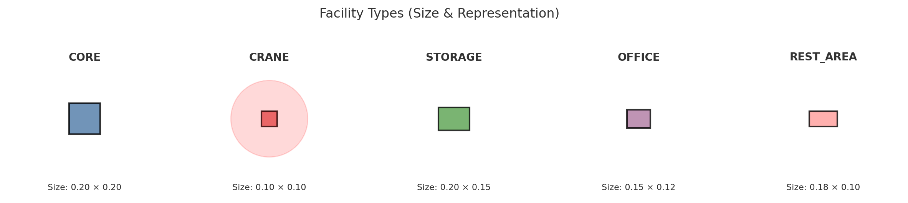

# Project information
This section separates into 4 main sections:
- Layout configurations
- Constraints
- Objective functions
- Behavioral descriptors
---

## 🏗️ Layout configurations

<p align="center">

</p>

### Facility selection range:

- **Minimum Facilities**: 3 (minimal operational site)
  - Always includes: `core`, `crane`, `storage`

- **Maximum Facilities**: 8 (complex multi-function site)
  - Includes: All 5 types + additional operational facilities

- **Default Configuration**: 6 facilities
  - Typical mix: `core`, `crane`, `storage`, `office`, `rest_area`, + 1 operational facility

```
Facility combination:

- If count ≥ 3:  Add [core, crane, storage]                     # Operational facilities
- If count ≥ 5:  Add [office, rest_area]                        # Worker facilities
- If count > 5:  Fill remaining with [core, storage, crane]     # Additional operational
- Finally: Shuffle order randomly (seed-controlled)
```

**Example Generations** (default seed=42):

| Count | Facility Mix | Breakdown |
|-------|--------------|-----------|
| 3 | `['storage', 'core', 'crane']` | 3 operational only |
| 4 | `['storage', 'core', 'crane', 'crane']` | 3 operational + 1 extra operational |
| 5 | `['storage', 'core', 'crane', 'rest_area', 'office']` | 3 operational + 2 worker |
| 6 | `['storage', 'core', 'crane', 'rest_area', 'office', 'storage']` | Balanced + 1 extra operational |
| 7 | `['storage', 'core', 'crane', 'rest_area', 'office', 'storage', 'crane']` | Balanced + 2 extra operational |
| 8 | `['storage', 'core', 'crane', 'rest_area', 'office', 'storage', 'crane', 'storage', 'core', 'crane']` | Full site |

---
## 🚧 Constraints
These are feasibility requirements that all valid layouts must meet:

### 1) Boundary compliance
All facilities must remain within site boundaries with margin clearance

$$C_1: \quad \forall i \in facilities, \quad \text{margin} \leq x_i, y_i \leq 1 - \text{margin}$$

where:
- $(x_i, y_i)$ = center position of facility $i$
- $\text{margin}$ = boundary clearance (default: 0.08)

**Violation measure:**

A layout violates this constraint if any facility extends beyond the boundary margins.

$$V_{boundary} = \sum_{i=1}^{n} \max\left(0, \text{margin} - x_i, x_i + \frac{w_i}{2} - 1 + \text{margin}, \text{margin} - y_i, y_i + \frac{h_i}{2} - 1 + \text{margin}\right)$$

### 2) No overlapping facilities
Facilities cannot physically overlap each other.

$$C_2: \quad \forall i \neq j, \quad A_{\mathrm{overlap}}(f_i, f_j) = 0$$

where:
- $f_i, f_j$ = facility rectangles $i$ and $j$
- $A_{\mathrm{overlap}}(\cdot, \cdot)$ = 2D rectangular intersection area function

**Violation measure:**

A layout violates this constraint if any two facilities have overlapping areas.

$$V_{\mathrm{overlap}} = \sum_{i < j} A_{\mathrm{overlap}}(f_i, f_j)$$

---
## 🎯 Objective functions
### 1) Safety compliance
Measures hazard prevention and worker protection.

$$O_1 = 1 - \min\left(1, \frac{\sum_{j \in \text{workers}} P_{danger}(j)}{n_{workers}}\right)$$

**Crane danger penalty** for worker facility $j$:

$$P_{danger}(j) = \begin{cases}
0 & \text{if } d_j \geq r_{danger} \\
\left(\frac{r_{danger} - d_j}{r_{danger}}\right) \times 0.3 & \text{if } d_j < r_{danger}
\end{cases}$$

where:
- $d_j$ = distance from nearest crane to worker facility $j$
- $r_{danger} = 0.25$ (crane danger radius)
- $\text{workers} = \{\text{office}, \text{ rest area}\}$

**Interpretation**:
- $O_1 = 1.0$ → All workers outside danger zones (safest)
- $O_1 = 0.5$ → Moderate safety compliance
- $O_1 = 0.0$ → Workers directly in crane operation zones (unsafe)

**Function**: `calculate_safety_compliance(facilities, entrances, config)`
- Returns: `(safety_score, feasible_flag, violation_list)`

### 2) Operational efficiency
Optimizes material flows, equipment accessibility, and workflow support

$$O_2 = 0.4 \times E_{flow} + 0.4 \times E_{access} + 0.2 \times E_{sequence}$$

where:
- $$E_{flow}$$ = Material flow efficiency
- $$E_{access}$$ = Equipment accessibility
- $$E_{sequence}$$ = Work sequence support

**Overall Efficiency Interpretation**:
- $O_2 = 1.0$ → Optimal material flows, full crane coverage, convenient access
- $O_2 = 0.7$ → Good efficiency with minor inefficiencies
- $O_2 < 0.5$ → Poor logistics, inadequate coverage

**Function**: `calculate_operational_efficiency(facilities, entrances)`
- Returns: `efficiency_score ∈ [0, 1]`

#### a) Material flow efficiency
Minimizes transport distances for critical material flows:Minimizes transport distances for critical material flows:

$$E_{flow} = 1 - \frac{\bar{d}_{flow}}{d_{max}}$$

where:
- $\bar{d}_{flow}$ = average distance for critical material flows: (storage→core, crane→core, storage→crane)
- $d_{max} = \sqrt{2} \times 0.8$ (site diagonal)

#### b) Equipment accessibility
Measures crane coverage over work areas with range-based quality:

$$E_{access} = \frac{1}{n_{work}} \sum_{w=1}^{n_{work}} C_w$$

where:
- $n_{work}$ = number of work areas (operational facilities: core, storage)
- $C_w$ = coverage quality for work area $w$
- $d_w$ = distance from work area $w$ to nearest crane

Crane coverage quality for work area $w$:

$$C_w = \begin{cases} 
1.0 & \text{if } d_w \leq 0.25 \quad \text{(optimal range)} \\
1.0 - \frac{d_w - 0.25}{0.15} \times 0.4 & \text{if } 0.25 < d_w \leq 0.40 \quad \text{(acceptable range)} \\
0.0 & \text{if } d_w > 0.40 \quad \text{(out of range)}
\end{cases}$$

Multiple crane bonus (encourages redundancy):

$$C_w' = \min\left(1.0, C_w + 0.15 \times (n_{cranes} - 1)\right)$$

where $n_{cranes}$ = number of cranes covering work area $w$ (within acceptable range)

#### c) Work sequence support
Ensures worker facilities have convenient entrance access:

$$E_{sequence} = \frac{1}{n_{offices}} \sum_{o \in \text{offices}} \max\left(0, 1 - \frac{d_{o,entrance}}{0.4\sqrt{2}}\right)$$

where $d_{o,entrance}$ = distance from office $o$ to nearest entrance


### 3) Layout adaptability
Measures future flexibility, expansion capacity, and reconfiguration potential.

$$O_3 = 0.4 \times A_{expansion} + 0.35 \times A_{redundancy} + 0.25 \times A_{reconfig}$$
